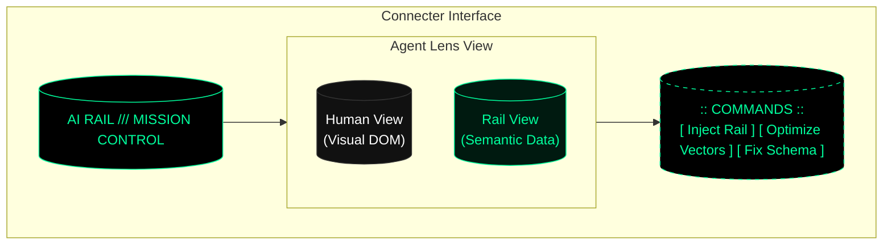

# AI Rail: Interactive Connector Concept

> [!IMPORTANT]
> **Vision**: Turn Claude into the "Mission Control" for your website's AI presence.

This interactive connector allows users to visualize, debug, and optimize how their digital estate appears to AI agents, directly within the chat interface.

## Visual Identity
**Theme**: `Cyber-Terminal / Construct`
- **Palette**: Deep void black background, neon rail-green (`#00ff9d`) accents.
- **Typography**: Monospace (Source Code Pro / JetBrains Mono).
- **Key Element**: The **ASCII Orb** serves as the central loading state and "AI Health" indicator. It pulses when agents are actively scanning or when optimization is in progress.

---

## Core Views

### 1. The Rail Gauge (Dashboard)
The default view when asking "How is my site doing?".
- **Visual**: A central HUD showing an "Agent Visibility Score" (0-100%).
- **Metrics**:
    - **Knowledge Graph Integrity**: Are entities connected?
    - **Payload Size**: Efficiency of the hidden AI data.
    - **Crawl Frequency**: How often agents are visiting.
- **Actions**: `scan_now`, `generate_report`.

### 2. The Agent Lens (Simulator)
A split-screen or toggle view comparing "Human Reality" vs. "Agent Reality".
- **Human View**: Renders the visual website (iframe or screenshot).
- **Agent View**: Renders the **Rail Payload**.
    - Shows the raw JSON-LD structure.
    - Highlights "invisible" content (text in images, complex JS).
    - Visualizes vector embeddings as a point cloud (simplified).
- **Interaction**: User can highlight a section in "Human View" and ask Claude to "Bridge to Rail", automatically generating the semantic markup for that section.

### 3. Knowledge Graph Editor
An interactive node-link diagram showing the brand's entity graph.
- **Visual**: Nodes represent Products, Pages, or Concepts. Edges represent relationships (`hasPart`, `isRelatedTo`, `offers`).
- **Interaction**:
    - **Drag & Drop**: Connect nodes to establish relationships.
    - **Click**: Edit node properties (names, descriptions, values).
    - **Ghost Nodes**: Claude suggests missing connections (e.g., "Your 'Pricing' page is isolated. Link it to 'Products'?").

## User Flows

### Flow A: "The Optimization Loop"
1. **User**: "Why does Claude think my pricing is $50?"
2. **Connector**: Opens **Agent Lens** on the Pricing Page.
3. **Visual**: Highlights the conflicting data (Outdated schema vs. Visual text).
4. **User**: "Fix it."
5. **Connector**: Updates the `rail-payload` (JSON-LD) to match the visual price.
6. **Visual**: The **ASCII Orb** spins up, turns green, and confirms "Knowledge Graph Updated".

### Flow B: "The Rapid Index"
1. **User**: "I just launched the confusing-product page."
2. **Connector**: Shows **The Rail Gauge**.
3. **Action**: User clicks "Broadcast to Agents".
4. **Visual**: A pulse requires from the center orb, referencing the "Rapid Indexing" feature.
5. **Result**: Real-time log showing "Google: Indexed", "Perplexity: Indexed", "Claude: Ingested".

---

## Technical Implementation Considerations

### MCP Tools Required
- `read_rail_payload(url)`: Fetches the AI-specific data.
- `simulate_agent_view(url)`: Returns the parsed semantic structure.
- `update_knowledge_graph(entity_id, data)`: Writes back to the CMS/Data source.
- `trigger_indexing(url)`: Pings configured webhooks.

### UI Components (React)
- **`<AsciiOrb />`**: Ported from the existing `ascii-orb.js` for React.
- **`<SplitPane />`**: For the Agent Lens comparision.
- **`<GraphCanvas />`**: For the Knowledge Graph editor (using `react-force-graph` or similar).

## Mockup of the "Agent Lens"

