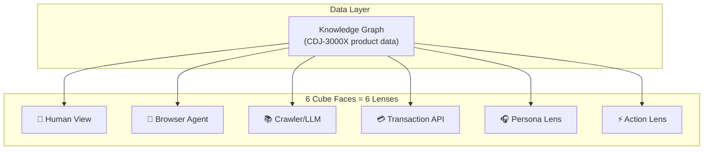

# AI Cube Multi-Lens Debugger

Transform the 3D cube into AI Rail's diagnostic interface where each face shows how different AI consumers interpret the same underlying product data.

## Concept Overview

| Face | Lens | What It Renders |
|------|------|-----------------|
| Front | **Human View** | Visual product page with images, styling, marketing copy |
| Right | **Browser Agent** | Semantic HTML structure, labeled elements for navigation |
| Back | **Crawler View** | Markdown representation optimized for LLM indexing |
| Left | **Transaction** | JSON API/structured data for purchasing agents |
| Top | **Persona Lens** | Content filtered for "Semi-Pro DJ" profile |
| Bottom | **Action Lens** | Intent-scopes highlighted (Buy, Add to Cart, etc.) |

---

## Proposed Changes

### Data Layer

#### [NEW] [KnowledgeGraph.js](file:///Users/chris/Documents/aicube/src/data/KnowledgeGraph.js)

Core data structure that all lenses read from. Extracted from `agent-optimized-view.html`:
- Product entity (name, brand, price, SKU)
- Specifications (tech specs, dimensions)
- Actions (add-to-cart, purchase intents)
- Persona relevance scores

---

### Lens Renderers

#### [NEW] [LensManager.js](file:///Users/chris/Documents/aicube/src/lenses/LensManager.js)

Orchestrates lens rendering. Maps face indices to lens types, provides `renderLens(faceIndex, ctx, data)` method.

#### [NEW] Lens Files in `src/lenses/`

| File | Description |
|------|-------------|
| `HumanLens.js` | Product card with image, price badge, marketing layout |
| `BrowserAgentLens.js` | DOM tree visualization with semantic labels |
| `CrawlerLens.js` | Markdown-style rendering with headers, lists |
| `TransactionLens.js` | JSON syntax-highlighted structured data |
| `PersonaLens.js` | Filtered view with relevance highlighting |
| `ActionLens.js` | Intent scopes with actionable element markers |

---

### Cube Integration

#### [MODIFY] [DesignManager.js](file:///Users/chris/Documents/aicube/src/DesignManager.js)

Replace mock design generation with lens rendering:
- Import `LensManager` and knowledge graph data
- Call `lensManager.renderToFace(faceIndex)` for each face
- Add lens labels overlay

---

### UI Components

#### [MODIFY] [index.html](file:///Users/chris/Documents/aicube/index.html)

Add info panel for current lens details and agent thoughts sidebar.

#### [MODIFY] [style.css](file:///Users/chris/Documents/aicube/src/style.css)

Add glassmorphic panel styling matching AI Rail aesthetic.

---

## Verification Plan

### Browser Testing

1. **Run dev server** (already running at `http://localhost:5173`)

2. **Manual verification checklist:**
   - [ ] Rotate cube through all 6 faces using arrow keys
   - [ ] Verify each face displays its distinct lens visualization:
     - Front: Human View (styled product card)
     - Right: Browser Agent (DOM tree)
     - Back: Crawler (Markdown)
     - Left: Transaction (JSON)
     - Top: Persona (filtered content)
     - Bottom: Action (intent markers)
   - [ ] Info panel updates when rotating to each face
   - [ ] Zoom in/out still works (pinch or mouse wheel)

---

## Implementation Order

1. Create `KnowledgeGraph.js` with CDJ-3000X data
2. Create `LensManager.js` + first lens (HumanLens)
3. Implement remaining 5 lenses
4. Update `DesignManager.js` to use lenses
5. Add UI panel and styling
6. Verify and polish
